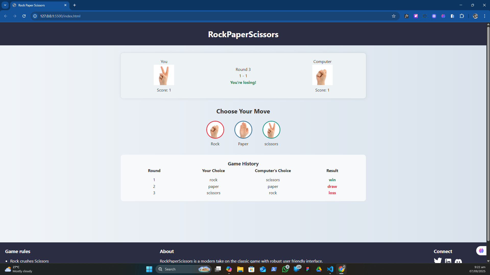
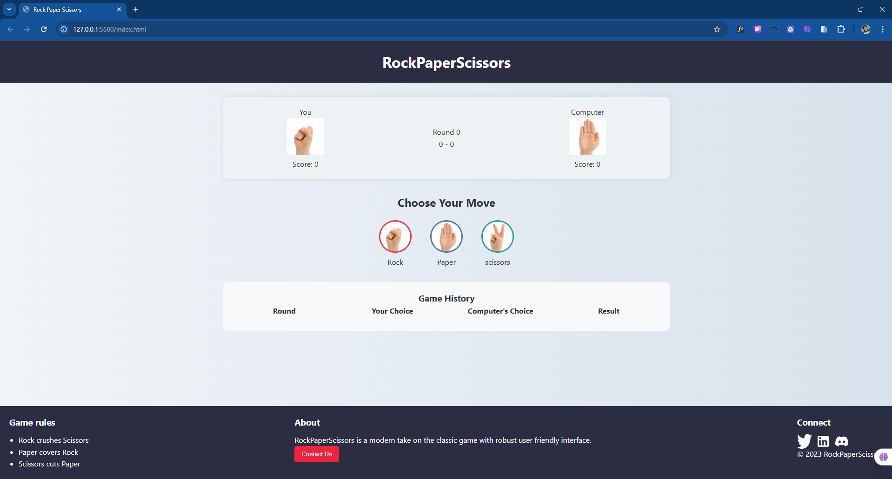
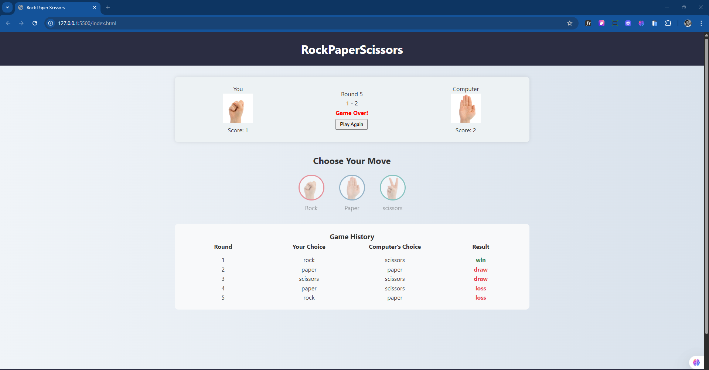

# 🎮 Rock Paper Scissors – Interactive Web Game

A modern, browser-based implementation of the classic Rock Paper Scissors game, built with **vanilla JavaScript**, **HTML5**, and **CSS3**. This project showcases dynamic DOM manipulation, modular architecture, and test-driven development using **Jest**. Designed with a clean UI, responsive layout, and engaging user feedback, it serves as both a fun experience and a demonstration of frontend engineering fundamentals.

---

## 🚀 Features

- **Interactive Gameplay**: Choose between rock, paper, or scissors and play against a randomized computer opponent.
- **Score Tracking**: Live score updates for both player and computer, with round-by-round history.
- **Game Rounds**: Game automatically ends after 5 rounds, with a clear result display.
- **Reset Functionality**: Restart the game seamlessly with a dedicated reset button.
- **High Score Persistence**: Stores and displays the highest score using `localStorage`.
- **Visual Feedback**: Color-coded move indicators and result highlights.
- **Responsive Design**: Optimized for desktop and mobile browsers.
- **Modular Codebase**: Clean separation of logic, UI handling, and utilities.
- **Unit Testing**: Core logic tested with Jest for reliability and maintainability.

---

## 🧱 Project Structure

```plaintext
rock-paper-scissors/
├── index.html               # Main HTML structure
├── styles/
│   └── style.css            # Custom styles
├── assets/
│   └── images/              # Game icons (rock, paper, scissors)
├── index.js                 # Entry point (ES module)
├── js/
│   ├── gameLogic.js         # Core game rules
│   ├── domHandler.js        # DOM updates and rendering
│   ├── scoreManager.js      # Score tracking and localStorage
│   └── utils.js             # Helper functions
├── tests/
│   ├── gameLogic.test.js    # Jest tests for game logic
│   ├── scoreManager.test.js # Jest tests for score functions
│   └── utils.test.js        # Jest tests for helpers
└── README.md                # Project documentation
```

---

## 🧩 Technologies Used

- **JavaScript (ES6+)**
- **HTML5**
- **CSS3**
- **Jest** (for unit testing)
- **LocalStorage API**

---

## 🛠️ Setup Instructions

### 1. Clone the Repository

```bash
git clone https://github.com/your-username/rock-paper-scissors.git
cd rock-paper-scissors
```

### 2. Install Dependencies

```bash
npm install
```

### 3. Run Tests

```bash
npm test
```

### 4. Launch Locally

Open `index.html` in your browser or use a local server (e.g. Live Server in VS Code).

---

## 🧪 Testing Strategy

Unit tests are written using **Jest** to validate:

- Game logic (`determineWinner`)
- Score updates (`updateScore`)
- Utility functions (`capitalize`)
- LocalStorage interactions

Tests are located in the `/tests` directory and can be run via `npm test`.

---

## 📸 Screenshots





---

## 📌 Future Improvements

- Add sound effects for win/loss feedback
- Implement dark mode toggle
- Introduce smarter AI logic (e.g. pattern recognition)
- Add animations and transitions for smoother UX

---

## 👨‍💻 Author

**Ernest Frimpong Opoku**  
Frontend Developer | IT Support Specialist  
Passionate about building interactive web experiences and empowering others through technology.

---

## 📄 License

This project is licensed under the MIT License. Feel free to use, modify, and share.

---
